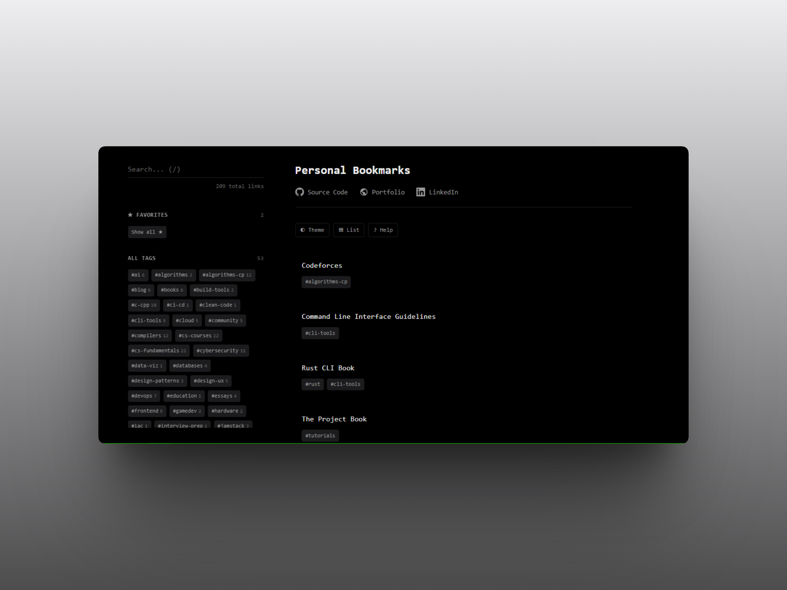

# Bookmarks

Minimal, keyboard-driven bookmark manager. Vanilla JS, no dependencies.



## Usage

1. Add your bookmarks to `bookmarks.txt`.
2. Open `index.html` in your browser.

## Bookmark Format

```text
- https://example.com | Title | #tag1,#tag2
```

## Shortcuts

| Key | Action |
|-----|--------|
| `j` / `k` | Navigate up / down |
| `g` / `G` | Go to top / bottom |
| `/` | Focus search |
| `Esc` | Clear search / Close modal |
| `f` | Toggle favorite |
| `y` | Copy URL |
| `Enter` | Open focused link |
| `v` | Toggle grid/list view |
| `t` | Toggle theme |
| `?` | Show shortcuts |

## Search Syntax

- `rust cli` -> Matches both
- `javascript -react` -> Excludes "react"

## Files

- `index.html`
- `styles.css`
- `main.js`
- `bookmarks.txt`